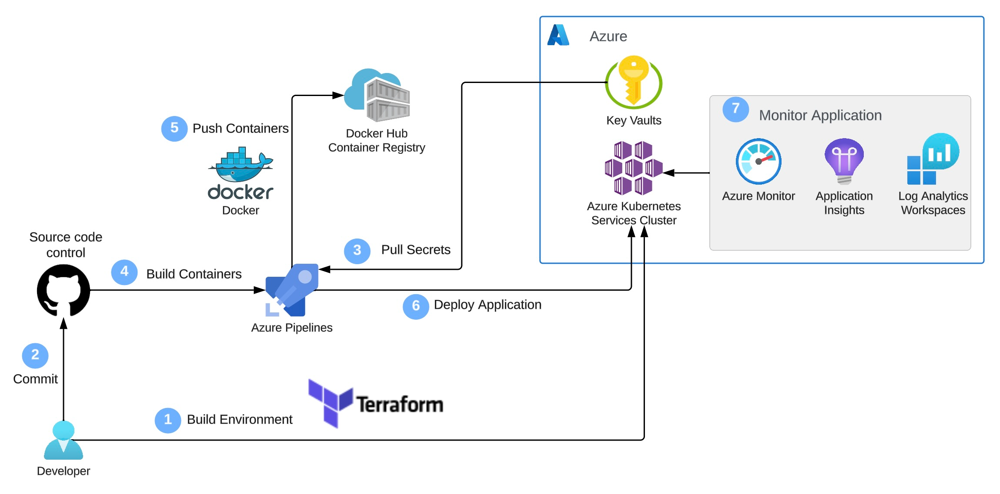

# Web-App-DevOps-Project

Welcome to the Web App DevOps Project repo! This application allows you to efficiently manage and track orders for a potential business. It provides an intuitive user interface for viewing existing orders and adding new ones.

## Table of Contents
- [Features](#features)
- [Getting Started](#getting-started)
- [Technology Stack](#technology-stack)
- [Usage](#usage)
- [Delivery date](#delivery-date)
- [Dockerfile](#dockerfile)
- [Terraform] (#Terraform)
- [Defining and AKS cluster] (#Defining-and-AKS-cluster)
- [Creating an AKS cluster] (#Creating-an-AKS-cluster)
- [Kubernetes Deployment to AKS] (#Kubernetes-Deployment-to-AKS)
- [CI/CD Pipeline with Azure DevOps] (#CI/CD-Pipeline-with-Azure-DevOps)
- [AKS Cluster Monitoring] (#AKS-Cluster-Monitoring)
- [Azure Key Vault for Secrets Management] (#Azure-Key-Vault-For-Secrets-Management)
- [Contributors](#contributors)
- [License](#license)

## Features

- **Order List:** View a comprehensive list of orders including details like date UUID, user ID, card number, store code, product code, product quantity, order date, and shipping date.
  

- **Pagination:** Easily navigate through multiple pages of orders using the built-in pagination feature.
  

- **Add New Order:** Fill out a user-friendly form to add new orders to the system with necessary information.
  

- **Data Validation:** Ensure data accuracy and completeness with required fields, date restrictions, and card number validation.

## Getting Started

### Prerequisites

For the application to succesfully run, you need to install the following packages:

- flask (version 2.2.2)
- pyodbc (version 4.0.39)
- SQLAlchemy (version 2.0.21)
- werkzeug (version 2.2.3)
- azure-identity (version 1.15.0)
- azure-keyvault-secrets (version 4.7.0)

### Usage

To run the application, you simply need to run the `app.py` script in this repository. Once the application starts you should be able to access it locally at `http://127.0.0.1:5000`. Here you will be meet with the following two pages:

1. **Order List Page:** Navigate to the "Order List" page to view all existing orders. Use the pagination controls to navigate between pages.

2. **Add New Order Page:** Click on the "Add New Order" tab to access the order form. Complete all required fields and ensure that your entries meet the specified criteria.

## Technology Stack

- **Backend:** Flask is used to build the backend of the application, handling routing, data processing, and interactions with the database.

- **Frontend:** The user interface is designed using HTML, CSS, and JavaScript to ensure a smooth and intuitive user experience.

- **Database:** The application employs an Azure SQL Database as its database system to store order-related data.

# DevOps Pipeline Architecture 

## Delivery Date
A delivery date column was added to app.py and orders.html files in the main branch by creating and merging branches from feature/add-delivery-date into main. In feature/add-delivery-date, modify the branch to add the delivery date to both files using Visual Studio Code/Git Bash. After the changes, use git add . to stage them, git commit -m "message" to the local repository, and git push --set-upstream origin feature/add-delivery-date to set up the branch in the remote repository. Finally, git push. Make a pull request from feature/add-delivery-date into main, review the changes, and merge the two branches.

### Reverting Changes:
It was unnecessary to modify the files, and the changes needed to be reverted using git pull to fetch contents from the remote repository (common practice in group work). Create a feature branch using git branch revert-delivery-date from the main branch. Switch to the branch using git checkout revert-delivery-date, use the git log command to find the log before merging into main, and git revert {number-of-revert} to revert the changes. Use git add . to stage the changes, git commit -m "message" to the local repository, and git push --set-upstream origin revert-delivery-date to create the branch. Finally, git push the changes into the remote repository. Make a pull request, check the changes into the main branch, and merge the two branches. Check out the main branch to see the changes made.

## Dockerfile
Developing a Dockerfile for the application involves encapsulating all essential dependencies and configuration settings. This containerization process ensures uniform application packaging and streamlines the deployment process.
### Step 1
**Base Image Selection:**
Begin by selecting an official Python runtime as the parent image. For a Flask application, python:3.8-slim is a suitable choice. 

**Set the Working Directory:**
Utilize the WORKDIR instruction to establish the working directory in the container. Set it to /app, a commonly used directory for web applications.

**Copy Application Files:**
Utilise the COPY instruction to transfer the contents of your local directory into the container's /app directory. This ensures accessibility of your application code and files within the container.

**Install Python Packages from requirements.txt:**
Install the Python packages outlined in your requirements.txt file. This file should encompass all the necessary packages for the successful execution of the application. Execute the command `pip install --trusted-host pypi.python.org -r requirements.txt` to install these packages.

**Expose Port 5000:**
Facilitate external access to your Flask application from outside the container by specifying the exposure of port 5000.

**Define Startup Command:**
Employ the CMD instruction to specify the command executed upon container launch. In this case, the command should run the file initiating the Flask application.

### Step 2 
Proceed to build your Docker image as it stands by executing the following command: docker build -t <name_of_the_image> .

### Step 3 
Run a local Docker container to verify the proper functioning of the application within the containerized environment. Initiate the Docker container by executing the following command: docker run -p 5000:5000 <name_of_the_image>. This command maps port 5000 from your local machine to the container, facilitating access to the containerized application from your local development environment. Access the application within the Docker container by opening a web browser and navigating to http://127.0.0.1:5000. Confirm the expected functionality of the application by testing its features within the containerized environment.

### Step 4 
Label your Docker image with pertinent details. Specify the image name, version, and Docker Hub repository using the following format: docker tag <name_of_the_image> <docker_hub_username>/<image_name>:<tag>. Employ the `docker push` command to upload the Docker image to Docker Hub. To ensure accessibility, perform a test by pulling the image from Docker Hub, preferably in your local development environment. After successfully pulling the image, run the container and confirm that the application functions as expected.

## Terraform
This will serve as the foundation for provisioning an Azure Kubernetes Service (AKS) cluster using infrastructure as code (IaC)

### Define the networking module 
### variable.tf
The following two variables should of type string, and one show be of type list (string)
Create the following variables:
- Resource_group_name variable: A container that includes the relevant Azure resources to be managed and deployed.
- Location variable: the location where the AKS cluster service will be situated. 
- vnet_address_space: a defined range of virtual addressed allocated to communicate among tasks within the resource group. 

### main.tf
Establish the fundamental networking resources required for an AKS cluster. This encompasses the creation of an Azure Resource Group, a VNet, two subnets (for the control plane and worker nodes), and a Network Security Group (NSG). 
Assign the following names to these resources:
1. **Azure Resource Group:** variable created earlier (container that includes relevant Azure resoucers to be managed and deployed).
2. **Virtual Network (VNet):** (Allows resources to communicate with each other).
3. **Control Plane Subnet:** (Manages the resources and clusters such as nodes and pods).
4. **Worker Node Subnet:** (A virtual machine that processes a portion of an application's workload).
5. **Network Security Group (NSG):** (Security rules that manage inbound and outbound traffic for several types of Azure resources)

### outputs.tf
Define the following output variables:
1. **vnet_id:** (Stores the ID of the previously created VNet, facilitating connection to the cluster module).
2. **control_plane_subnet_id:** (Holds the ID of the control plane subnet within the VNet, specifying the subnet for AKS cluster control plane components).
3. **worker_node_subnet_id:** (Stores the ID of the worker node subnet within the VNet, specifying the subnet for AKS cluster worker nodes).
4. **networking_resource_group_name:** (Provides the name of the Azure Resource Group where networking resources were provisioned, ensuring alignment with the cluster module resources).
5. **aks_nsg_id:** (Stores the ID of the Network Security Group (NSG), facilitating association with the AKS cluster for security rule enforcement and traffic filtering).

Finally, you would now use the following command terraform init to initalise the directory. 

## Defining and AKS cluster
### Define the subsequent input variables:
input variables: 
1. **aks_cluster_name:** (Represents the name of the AKS cluster to be created).
2. **cluster_location:** (Specifies the Azure region where the AKS cluster will be deployed).
3. **dns_prefix:** (Defines the DNS prefix of the cluster).
4. **kubernetes_version:** (Specifies the Kubernetes version the cluster will use).
5. **service_principal_client_id:** (Provides the Client ID for the service principal associated with the cluster).
6. **service_principal_secret:** (Supplies the Client Secret for the service principal).

Additionally, you would include the output variables as input variables in this module. 
1. **resource_group_name:** (The name of the Azure Resource Group where networking resources were provisioned).
2. **vnet_id:** (The ID of the previously created VNet).
3. **control_plane_subnet_id:** (The ID of the control plane subnet within the VNet).
4. **worker_node_subnet_id:** (The ID of the worker node subnet within the VNet).

### cluster module output variables 
output variables:
1. **aks_cluster_name:** (Stores the name of the provisioned cluster).
2. **aks_cluster_id:** (Stores the ID of the cluster).
3. **aks_kubeconfig:** (Captures the Kubernetes configuration file of the cluster, crucial for interacting with and managing the AKS cluster using kubectl).
Once you've configured the settings, initiate the directory using `terraform init`. The setup will be on the main branch within the aks-cluster directory.

## Creating an AKS cluster 
Integrate the networking resources previously defined in their respective module so they are accessible in the main project.
Ensure that you supply the specified input variables when invoking the module:
- Set `resource_group_name` to a descriptive name, for instance, "networking-rg."
- Set `location` to an Azure region geographically close to you to enhance latency (e.g., "UK South").
- Set `vnet_address_space` to ["10.0.0.0/16"].
### integrate the cluster module 
Assign the following values to the specified input variables when invoking the module:
- Set `cluster_name` to "terraform-aks-cluster."
- Set `location` to an Azure region geographically close to you to enhance latency (e.g., "UK South").
- Set `dns_prefix` to "myaks-project."
- Set `kubernetes_version` to a supported Kubernetes version by AKS, such as "1.26.6."
- Set `service_principal_client_id` and `service_principal_secret` to your service principal credentials.
- Utilise variables referencing the output variables from the networking module for the remaining input variables required by the cluster module, including `resource_group_name`, `vnet_id`, `control_plane_subnet_id`, `worker_node_subnet_id`, and `aks_nsg_id`.

After configuring the settings, initialise the directory using `terraform init`. The setup will be on the main branch within the aks-terraform directory. Once all configurations are initialised, execute `terraform apply` to create the cluster in Azure using AKS (Azure Kubernetes Services).

### service principal 
Ensure you create a service principle to do this follow the command below, this ensures restriction to sensitive information
az ad sp create-for-rbac --name {name} --role contributor --scopes /subscriptions/{your-subscription-id}

## Kubernetes Deployment to AKS 
Kubernetes automates the orchestration of containerised applications, streamlining processes such as scaling, software deployment, and management.
### Kubernetes manifest definition - deployment 
Create a Kubernetes manifest file named "application-manifest.yaml." Define a Deployment resource named "flask-app-deployment." Specify two replicas for concurrent running in the AKS cluster, using the label "app: flask-app" in the selector field. In the metadata section, use the label "app: flask-app" for the pod template. Point to the Docker Hub-hosted container for deployment. Expose port 5000 for AKS cluster communication. Implement the Rolling Updates deployment strategy to maintain application availability during updates.
### Kubernetes manifest defintion - services 
Add a Kubernetes Service manifest to the existing application-manifest.yaml for internal communication within the AKS cluster. You can include multiple manifests in the same .yaml file using the --- operator between distinct services configurations. This manifest should:
- Define a service named "flask-app-service" as a reference for routing internal communication.
- Ensure the selector matches the labels (app: flask-app) of the previously defined pods in the Deployment manifest, directing traffic efficiently to the appropriate pods for seamless internal communication.
- Configure the service to use TCP protocol on port 80 for internal communication within the cluster. Set the targetPort to 5000, corresponding to the port exposed by your container.
- Set the service type to ClusterIP, designating it as an internal service within the AKS cluster.
### Testing and validating deployments on AKS 
- verify the health of your pods and services, commence port forwarding using the kubectl port-forward <pod-name> 5000:5000 command. This command establishes a secure channel to your application, enabling local interaction.
- With port forwarding established, access your web application hosted within the AKS cluster locally at http://127.0.0.1:5000.

## CI/CD Pipeline with Azure DevOps
- Continuous Integration (CI) involves automatically integrating code changes into a shared repository, triggering an automated build process for code compilation and testing. 
- Continuous Deployment (CD) extends this by automating deployment to different environments. Azure DevOps, a Microsoft toolset, provides services for version control, build automation, and release management, enabling teams to automate and streamline software delivery. 

Allowing for automating the building, testing, and deployment of software applications with Azure DevOps for rapid and reliable delivery.

### Initialise DevOps Pipeline 
The initial step is to configure the source repository for the pipeline. Opt for GitHub as the source control system hosting your application code, ensuring the selection of the repository you've been using in your work thus far.

### Azure DevOps-Docker Hub connection 
Establish a service connection between Azure DevOps and the Docker Hub account hosting the application image, ensuring smooth integration of the CI/CD pipeline with the Docker Hub container registry. Follow these steps to configure this connection:
1. Generate a personal access token on Docker Hub.
2. Configure an Azure DevOps service connection to utilise this token.
3. Confirm the successful establishment of the connection.

### Configure pipeline for docker image build and push 
Adjust your pipeline configuration to enable building and pushing a Docker image to Docker Hub. 
1. Integrate the Docker task with the buildandPush command into your pipeline. Use the same Docker image name as when pushing to Docker Hub from your local development environment.
2. Configure the pipeline to run automatically with each push to the main branch of the application repository.
3. Execute the CI/CD pipeline and subsequently test the newly created Docker image. Pull the latest version from Docker Hub on your local environment, run the container, and assess its functionality to ensure the application works as expected.

### Azure DevOps-AKS Connection
Establish and set up an AKS service connection in Azure DevOps. This connection facilitates a secure link between the CI/CD pipeline and the AKS cluster, ensuring smooth deployments and efficient management.

### pipeline for kubernetes deployment
Adjust the configuration of the CI/CD pipeline to include the Deploy to Kubernetes task with the deploy kubectl command.
- Utilise the deployment manifest within the application repository and the previously established AKS connection to facilitate the automatic deployment of the application to the AKS cluster.

### Testing and validation of CI/CD pipleline 
To securely access your application running on AKS, commence port forwarding using kubectl. Access the locally exposed address supplied by the cluster and test your application's functionality to ensure it operates correctly, thereby validating the CI/CD pipeline's effectiveness in deploying the application.

## AKS Cluster Monitoring 
Generate, configure, and save the following charts in Metrics Explorer:
1. **Average Node CPU Usage:** (Track the CPU usage of your AKS cluster's nodes. This aids in efficient resource allocation and identifies potential performance issues).
2. **Average Pod Count:** (Display the average number of pods running in your AKS cluster. This metric is essential for evaluating the cluster's capacity and workload distribution).
3. **Used Disk Percentage:** (Monitor disk usage to prevent storage-related issues. This chart helps track the amount of utilised disk space).
4. **Bytes Read and Written per Second:** (Monitor data I/O for identifying potential performance bottlenecks. This chart provides insights into data transfer rates).

Access the dashboard where the charts are saved and verify the correct visualisation of the data.

### log analytics configuration 
Configure Log Analytics to execute and store the following logs:
1. **Average Node CPU Usage Percentage per Minute:** (capture granular data on node-level CPU usage, with logs recorded per minute).
2. **Average Node Memory Usage Percentage per Minute:** (Similar to CPU usage, monitor memory usage at the node level to detect memory-related performance concerns and efficiently allocate resources).
3. **Pods Counts with Phase:** (Provide information on the count of pods with different phases, including Pending, Running, or Terminating. Gain insights into pod lifecycle management and ensure the appropriate distribution of the cluster's workload).
4. **Find Warning Value in Container Logs:** (Configure Log Analytics to search for warning values in container logs, proactively detecting issues or errors within your containers for prompt troubleshooting and resolution).
5. **Monitoring Kubernetes Events:** (Monitor Kubernetes events, such as pod scheduling, scaling activities, and errors, crucial for tracking the overall health and stability of the cluster).

### Alert configuration 
- Establish an alert rule to activate an alarm when the used disk percentage in the AKS cluster surpasses 90%. This alert is crucial for proactively identifying and resolving potential disk issues that may result in performance degradation and service interruptions.
- The alert should be set to check every 5 minutes with a loopback period of 15 minutes. Configure the alert to send notifications to your email address, enabling you to assess the best strategy for responding to these alarms.
- Modify the alert rules for CPU usage and memory working set percentage to activate when they surpass 80%. CPU and memory are vital resources in your AKS cluster, and their heavy utilization can result in decreased application performance. Setting alert rules to trigger at 80% ensures timely notifications when these resources approach critical levels.

## Azure Key Vault for Secrets Management 
Azure Key Vault serves as a robust solution for securely storing and managing sensitive information, providing a scalable and centralized platform for safeguarding such data. 

### Creating an Azure Key Vault:

Locate the Key Vaults service.
Click on the '+ Create' button.
Choose the subscription and either select a resource group or create one.
Provide a unique name for the Key Vault.
Select the region for your Key Vault.
After making changes, click 'Review + create' to double-check settings.
Click 'Create' to initiate the deployment of your Azure Key Vault.
Assigning RBAC Roles in Key Vault:

### Select a Key Vault.
Choose the 'Access control (IAM)' tab.
Click '+ Add' and choose 'Add a role assignment.'
Select 'Key Vault Administrator' from the list.
In 'Members,' click 'Select members' and choose the member to add.
After adding users, click 'Review + assign.'
Adding Secrets in Key Vault:

### Locate your Key Vault and select the Secrets tab.
Click '+ Generate/Import' and configure your secrets.
Create 4 secrets for environment variables.
Provide names and secret values acting as passwords.
After configuration, create the secrets.
Ensure that both the secrets and database credentials in app.py share the same name.

### User-Assigned Managed Identity:
It provides secure access to various Azure services and can be used for authenticating and authorizing access to other Azure resources.

To create a user-assigned managed identity use the following command: az identity create -g {Resource-Group-name} -n {name-the-User-Identity}. 

### Integrating Azure Key Vault with AKS
To apply Managed Identity for AKS use the following command: az aks update --resource-group <resource-group> --name <aks-cluster-name> --enable-managed-identity. Ensure to your the resource goup ID and the terraform cluster ID you created earlier. 

### Grant Key Vault permissions to the managed identity
Enusre to use the followjng command to assign your key valuts secret officer: az role assignment create --role "Key Vault Secrets Officer" \
--assignee <managed-identity-client-id> \
--scope subscriptions/{subscription-id}/resourceGroups/{resource-group}/providers/Microsoft.KeyVault/vaults/{key-vault-name}. 

### Testing Phase:
1. Push modified app.py and requirements.txt to the main branch.
2. Delete old pods for new pods to be used.
3. Use kubectl port-forward {name-of-pod} 5000:5000 to access the application.
4. Add a new order to check if it interacts with the database.
5. Optional: to verify the order,  place an order on screen.

### Python libaries and requirements to add 
install the following applicaitons as well as updates the requirements.txt file with the version you have installed: 
- pip install azure-identity
- pip install azure-keyvault-secrets

## Contributors 
- [Maya Iuga]([https://github.com/yourusername](https://github.com/maya-a-iuga))
- [Anishah Hussain] (https://github.com/anishah78/Web-App-DevOps-Project.git)

## License
This project is licensed under the MIT License. For more details, refer to the [LICENSE](LICENSE) file.
